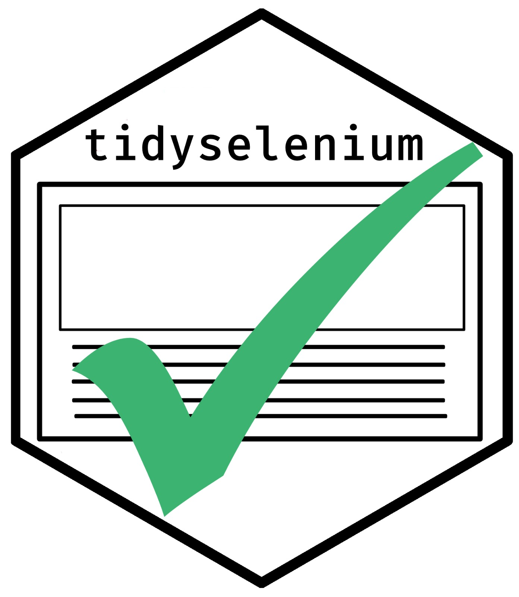

<!-- README.md is generated from README.Rmd. Please edit that file -->

# tidyselenium 

[](https://www.tidyverse.org/lifecycle/#experimental)
[](https://github.com/benjaminguinaudeau/tidyselenium)
[](https://github.com/benjaminguinaudeau/tidyselenium/commits/master)

This package provides tool to use Selenium driver functions in pipeline.

``` r
chrome <- chrome_init("chrome")
```

## Thanks

A huge thank you to [Favstats](https://github.com/favstats) for
designing each of the hex-stickers.
